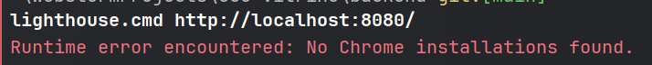

# Ce qui a été fait
    - Un back end utilisant express avec une route pour créer des articles et une pour les récupérer.
    - Un front avec la page Articles qui affiche tous les articles en les récupérant 6 par 6 de manière "lazy".
    - Une base SurrealDB avec la table stockant les articles.
# Ce qui était prévu
    - Une config nginx
    - Formulaire d'ajout des articles avec compression en WEBP et reformattage auto des images
    - Stockage des images sur le server
    - Une page HOME avec un carousel affichant les derniers articles
    - Une page contact avec un fromulaire permettant d'envoyer les infos
    ...

# Bilan d'Eco-conception:
## Bilan lighthouse...

## Matériel utilisé
pc portable, écran unique, petite résolution, wifi

=> consomme moins d'énergie et de ressources qu'un autre type de machine.

## Hébergeur choisi
**O2Switch** => Des serveurs situés en France donc meilleure proximité avec la cible du site.
\+ Utilisations d'énergies décarbonées et recycle ses serveurs auprès de fournisseurs français.

## Deploiement
**Utilisation de docker** => ressources plus optimisées.

**Limitation des logs** => moins de stockage.

**Une CI/CD optimisée:**
- Déclenchement des pipelines seulement quand c'est nécessaire. (Commit sur main en excluant certains fichiers inutiles (ex: CSS, doc...))
- Exécution des tests uniquement sur les branches pertinentes.
- Avec une "merge queue" en cas de multiples PR pour éviter les builds inutiles.
- Optimisation des machines utilisées par les pipelines.

## Mise en place de chache d'optimisation
- Dans les images docker.
- Dans les pipelines.
- Dans l'application.

=> Réduis le nombre de ressources CPU et de requêtes en échange d'un peu de RAM.

## Mise en place d'un monitoring GreenIT
=> Dans une démarche d'amélioration continue, ce monitoring permet de suivre l'évolution et de trouver des axes d'améliorations pour réduire l'impact environnemental.

## Mise en place d'une clean architecture & Suivi des bonnes pratiques de dev
=> Cela permet d'améliorer la maintenabilité et donc de réduire le nombre de temps (et de ressources) pour le scaling de l'entreprise.

## Réduction de l'impression
- Signatures électroniques
- Documents PDF plutôt que le papier
- Utilisation de service tel que Digiposte pour les documents administratifs plutôt que le courriel

## Gouvernance:
**Recherche de normes écologiques telles que:**
   - ISO 50001 : performance énergétique
   - ISO 26000 : responsabilité sociale des entreprises (RSE)
   - ISO 14000 : management environnemental